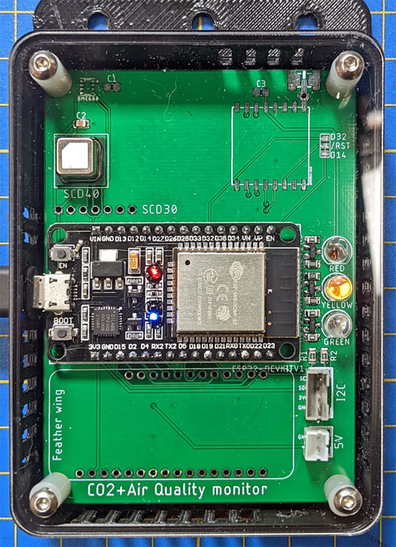
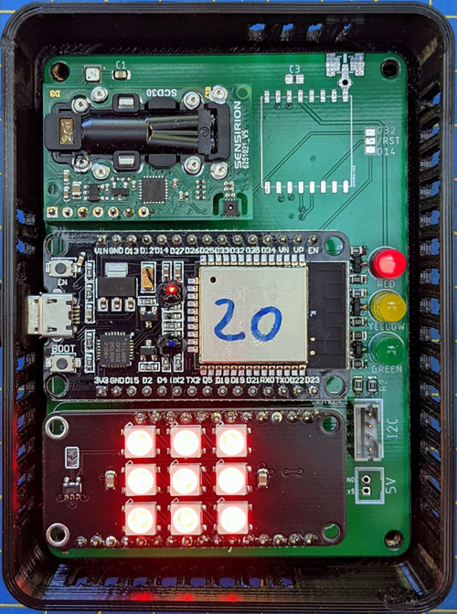

# CO2 and Air Quality Monitor

**ESP32 DevKit (30pin) or Feather based**

Inspired by and many thanks to
[make-IoT / CO2-Ampel](https://github.com/make-IoT/CO2-Ampel) and [Umwelt-Campus](https://www.umwelt-campus.de/en/forschung/projekte/iot-werkstatt/translate-to-englisch-ideen-zur-corona-krise)






# Use case

A large risk of Covid-19 transmission stems from airborne virus particles that can linger in poorly ventilated spaces for hours. This has been recognised by the WHO. To lower the risk of infection, particularly in busier indoor settings, good ventilation and regular air exchange are key.

This is where measuring CO2 levels in rooms can provide a direct and good indication of sufficient ventilation which correlates with reduced viral load and low risk of virus transmission. Good air quality is also important for creating a good learning or work environment.

Poorly ventilated rooms often feel stale and ‘stuffy’, but by the time we can feel that the air quality is already pretty poor and early indications are easily missed. A more sensitive and consistent CO2 monitor can accurately measure CO2 levels and display an easy-to-understand and actionable traffic light indication with orange as an indication of worsening air quality and red as a reminder to open a window.

The data collected by the sensors should be logged and made available for further consumption. It can be visualised a central school wide dashboard and used to establish a baseline and understand patterns or identify rooms that are more difficult to ventilate, as well as potentially alerting or to remotely check a room before another group uses it.

# Firmware

## Wifi

Supports [ESPAsync WiFiManager](https://github.com/khoih-prog/ESPAsync_WiFiManager) to set up wireless credentials and further configuration.

If no wifi credentials have been configured yet it will automatically launch an AP using the SSID `CO2-Monitor-<ESP32mac>`. A password can be configured in `ap_pw.h`.

Once wifi credentials have been configured pressing the `Boot` button on the ESP32 puts the device in configuration mode:


## MQTT

Sensor readings can be published via MQTT for centralised storage and visualition. Each node is configured with its own id and will then publish under `co2monitor/<id>/up/sensors`. The top level topic `co2monitor` is configurable. Downlink messages to nodes can be sent to each individual node using the id in the topic `co2monitor/<id>/down/<command>`, or to all nodes when omitting the id part `co2monitor/down/<command>`

```
{
  "co2": 752,
  "temperature": "21.6",
  "humidity": "52.1"
}
```

Sending `co2monitor/<id>/down/getConfig` will triger the node to reply with its current settings under `co2monitor/<id>/up/config`

```
{
  "altitude": 10,
  "yellowThreshold": 800,
  "redThreshold": 1000,
  "darkRedThreshold": 2000,
  "ledPwm": 255,
  "mac": "xxxxyyzz",
  "ip": "192.168.1.2"
}
```

A message to `co2monitor/<id>/down/setConfig` will set the node's configuration to the provided parameters:

```
{
  "altitude": 10,
  "yellowThreshold": 800,
  "redThreshold": 1000,
  "darkRedThreshold": 2000,
  "ledPwm": 255
}
```

A message to `co2monitor/<id>/down/setTemperatureOffset` will set the SCD3x/SCD4x's temperature offset (float, °C):

```
7.0
```

A message to `co2monitor/<id>/down/reboot` will trigger a reset on the node.

## Supported sensors

- [SCD3x CO2, temperature and humidity sensor](https://www.sensirion.com/en/environmental-sensors/carbon-dioxide-sensors/carbon-dioxide-sensors-scd30/)
- [SCD4x CO2, temperature and humidity sensor](https://www.sensirion.com/en/environmental-sensors/carbon-dioxide-sensors/carbon-dioxide-sensor-scd4x/)
- [BME680 IAQ, VOC, temperature and humidity sensor](https://www.bosch-sensortec.com/products/environmental-sensors/gas-sensors/bme680/)

## Supported displays

- [128x32 OLED feather wing](https://www.adafruit.com/product/2900)
- [SSD1306 based displays](https://www.aliexpress.com/wholesale?SearchText=128X64+SSD1306)
- [Dot Star feather wing](https://www.adafruit.com/product/3449)
- [Neopixel feather wing](https://www.adafruit.com/product/2945)
- Neopixel strips
- [HUB75 based RBG Matrix panels](https://www.adafruit.com/?q=RGB+LED+Matrix+Panel&sort=BestMatch)

# Sensors

The presence of supported I2C based sensors/displays will be automatically detected on start-up.

## SCD3x

A SCD3x sensor can be connected to the designated footprint and will provide CO2, temperature and humidity readings via I2C. It supports a separate ready signal which is connected to the ESP32.

## SCD4x

A SCD4x sensor can be soldered directly onto the pcb and provides CO2, temperature and humidity readings via I2C.

## BME680

A BME680 sensor can be directly soldered onto the dedicates footprint or connected via the I2C JST header [Adafruit BME680](https://www.adafruit.com/product/3660), [STEMMA to JST SH Cable](https://www.adafruit.com/product/4424) to provide additional VOC and AIQ measurements.

## other

Other I2C based sensors can be wired using the JST I2C header.

# Hardware

The board was designed to use an ESP32 or a Feather controller

## ESP32

When an ESP32 is used the feather footprint can be used to drive feather wings. Since some pins are shared with other components please check carefully before connecting a feather.

## Feather

A feather controller can be used to drive the sensors and LEDs, but unfortunately not the RFM96.

## Pin mapping

| ESP32 Devkit (30 pin) | fn       | Feather pin | fn    | LEDs   | SCD3x/4x/BME680 | RFM96   |
| --------------------- | -------- | ----------- | ----- | ------ | --------------- | ------- |
| 1                     | EN       |             |       |        |                 |         |
| 2                     | VP-D36   | 9           | A4    |        |                 |         |
| 3                     | VN-D39   | 8           | A3    |        |                 |         |
| 4                     | D34      | 7           | A2    |        |                 |         |
| 5                     | D35      |             |       |        | RDY (SCD3x)     |         |
| 6                     | D32      | 20          | D6    |        |                 | (RESET) |
| 7                     | D33      | 22          | D10   |        |                 |         |
| 8                     | D25      | 6           | A1    | Red    |                 |         |
| 9                     | D26      | 5           | A0    | Yellow |                 |         |
| 10                    | D27      | 23          | D11   | Green  |                 |         |
| 11                    | D14      | 19          | D5    |        |                 | RESET   |
| 12                    | D12      | 24          | D12   |        |                 |         |
| 13                    | D13      | 25          | D13   |        |                 |         |
| 14                    | GND      |             |       |        |                 |         |
| 15                    | V_in     |             | V_USB |        |                 |         |
| 16                    | 3V3      |             |       |        |                 |         |
| 17                    | GND      |             |       |        |                 |         |
| 18                    | D15      | 21          | D9    |        |                 |         |
| 19                    | D2       |             |       |        |                 |         |
| 20                    | D4       | 10          | A5    |        |                 |         |
| 21                    | D16      |             |       |        |                 | DIO1    |
| 22                    | D17      |             |       |        |                 | DIO0    |
| 23                    | D5/CS0   |             |       |        |                 | NSS     |
| 24                    | D18/SCK  | 11          | SCK   |        |                 | SCK     |
| 25                    | D19/MISO | 13          | MISO  |        |                 | MISO    |
| 26                    | D21/SDA  | 17          | SDA   |        | SDA             |         |
| 27                    | D3/Rx    | 14          | Rx    |        |                 |         |
| 28                    | D1/TxD   | 15          | Tx    |        |                 |         |
| 29                    | D22/SCL  | 18          | SCL   |        | SCL             |         |
| 30                    | D23/MOSI | 12          | MOSI  |        |                 | MOSI    |

## LEDs

The board has room for 3 x 5mm LEDs for traffic light style indication. Each is driven by a transistor to relieve the ESP32/Feather GPIO pins. High intensity LEDs allow for good visibility, but can also be dimmed using the ESP32 internal PWM channels if needed.

- [Green, 12.5cd, 30°, 20 mA, 3.2 V](https://nz.element14.com/cree/lc503fpg1-30q-a3-00001/led-5mm-green/dp/1648988) (use 5Ω resistor)
- [Yellow, 9.3cd, 30°, 20 mA, 2.1 V](https://nz.element14.com/broadcom-limited/hlmp-el3g-vx0dd/led-amber-9-3cd-590nm-th/dp/2900814) (use 60Ω resistor)
- [Red, 9.3cd, 30°, 20 mA, 2.1 V](https://nz.element14.com/broadcom-limited/hlmp-eg3a-wx0dd/led-5mm-alingap-red-30deg/dp/1706677) (use 60Ω resistor)

## Neopixel

in `config.h` uncomment

```
#define NEOPIXEL_PIN          4   // pin
#define NEOPIXEL_NUM          8   // number ofNeopixels
```

## Feather wings

### [6 x 12 DotStar](https://www.adafruit.com/product/3449)

in `config.h` uncomment

```
#define FEATHER_MATRIX_DATAPIN    27
#define FEATHER_MATRIX_CLOCKPIN   13
```

### [128x32 OLED](https://www.adafruit.com/product/2900)

in `config.h` set

```
#define SSD1306_HEIGHT  32
```

### [128x64 OLED](https://www.aliexpress.com/wholesale?SearchText=128X64+SSD1306)

in `config.h` set

```
#define SSD1306_HEIGHT  64
```

### [64x32 RBG Matrix panel](https://www.adafruit.com/?q=64x32+RGB+LED+Matrix&sort=BestMatch)

in `config.h` set pin mappings as needed, e.g.

```
#define HUB75_R1 19
#define HUB75_G1 18
#define HUB75_B1 5
#define HUB75_R2 17
#define HUB75_G2 16
#define HUB75_B2 4
#define HUB75_CH_A 13
#define HUB75_CH_B 12
#define HUB75_CH_C 14
#define HUB75_CH_D 27
#define HUB75_CLK 26
#define HUB75_LAT 25
#define HUB75_OE 33
```

## RFM96

This allows adding a LoRa modem when no WiFi is available to transmit measurements.
