# Step by step assembly guide

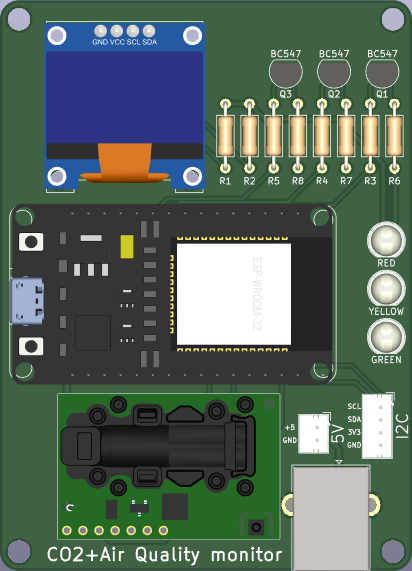

## Preparations


Before you start make sure you have all [required parts](./bom.md) and tools ready. You'll need

- soldering iron
- solder
- good ventilation and ideally a solder fume extractor
- side cutters
- safety glasses
- USB power
- micro USB cable
- 2mm alan key
- (optional) multimeter

## PCB assembly

1. Start with soldering the resistors to the pcb. If you are unsure about the resistor values and don't have a multimeter handy use a [resistor colour code decoder](https://www.digikey.co.nz/en/resources/conversion-calculators/conversion-calculator-resistor-color-code) to confirm the correct value. Bend the resistors at ~10mm and put them through the pcb before soldering them in place. Cut the wires close to the pcb once soldered in place.

   

   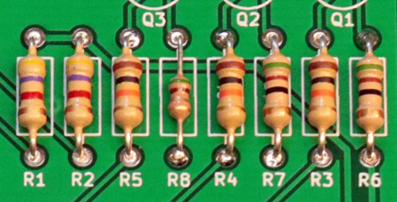

   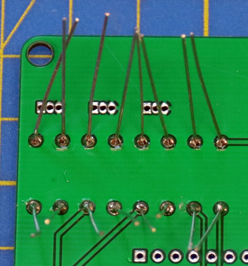

   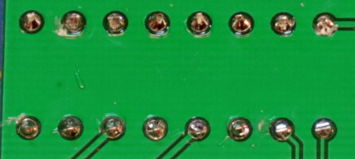

2. Place the 3 BC547 transistors in place making sure the flat side of the package aligns with the shape of the silkscreen. You might have to bend the wires a little to make them fit and they do not need to be pushed all the way to the bottom, but make sure that the wires don't touch each other.

   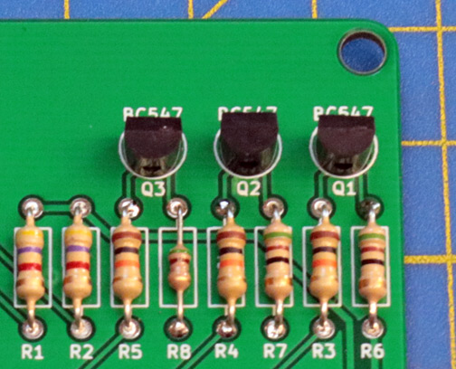 

3. The 3 LEDs must be installed in the correct orientation with the anode (+ side) facing the top of the pcb. The lead on the anode is a little longer. You can also check the correct orientation with a multimeter

   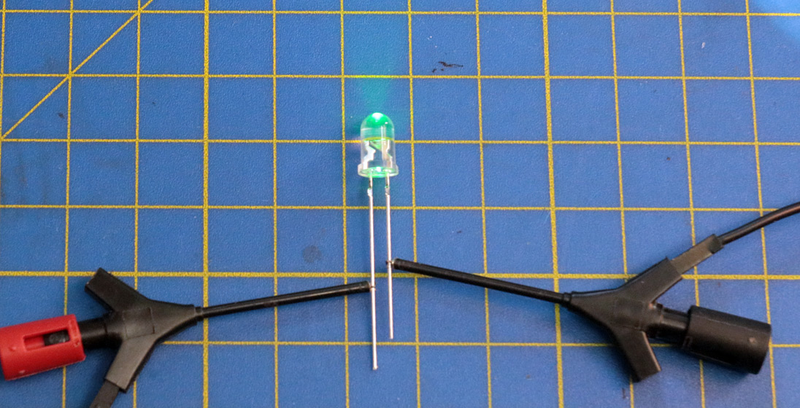

   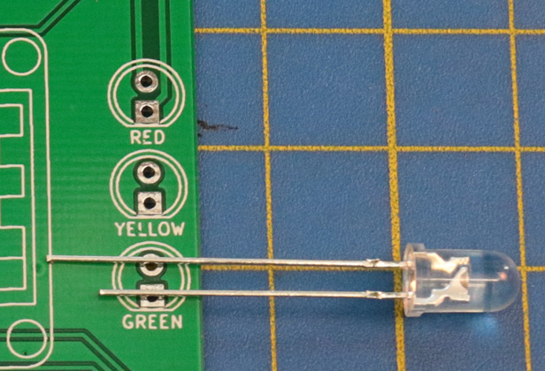

   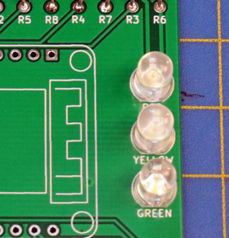

4. The ESP32 mcu comes next. Make sure to install it in the right direction with the USB port facing left. It can be a little difficult to push in if the pins don't perfectly align. In that case start at one side and slowly move from pin to pin and carefully push each pin into position. Start soldering at one end and check that it is fully inserted after soldering the first pin before continuing. When clipping the pins be careful since they are thicker and tend to fly away. Wear safety glasses and cover under a cloth/rug when clipping the pins.

   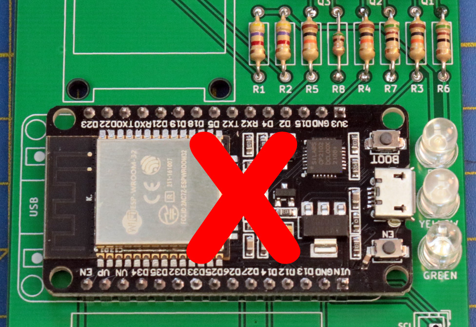

   

5. Solder only one pin of the display before checking the correct alignment. It's easier to adjust while only one pin is connected. Then solder the remaining pins. Leave the protective film on the display for now.

   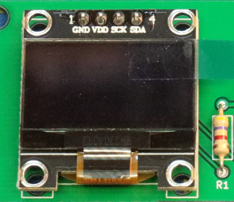

6. If the SCD30 sensor comes without a pre-soldered pin header solder a 7 pin header to the sensor first. If you have a prototyping bread board available use it to keep the pin header straight, otherwise carefully solder one pin only and adjust as needed before completing the remaining ones.


Solder the SCD30 sensor to the main pcb while making sure it lays flat on the board. The pins don't get pushed in all the way.


7. (optional) Place and solder the JST headers for power and I2C and the USB-B power connector

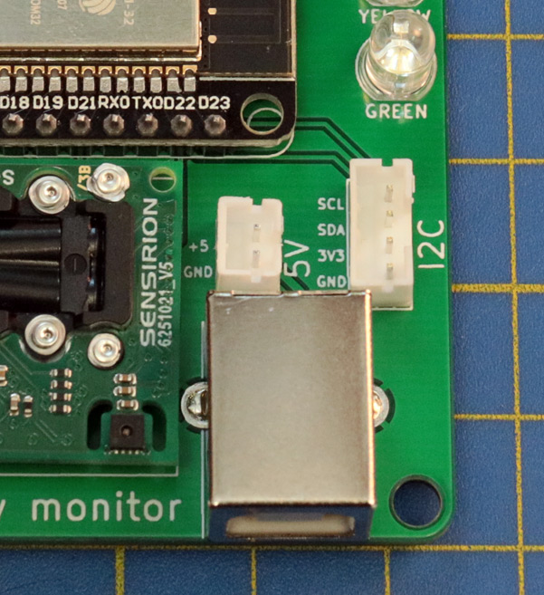

8. (optional) apply a small amount of liquid electrical tape over the 2 LEDs on the ESP32 to reduce their brightness

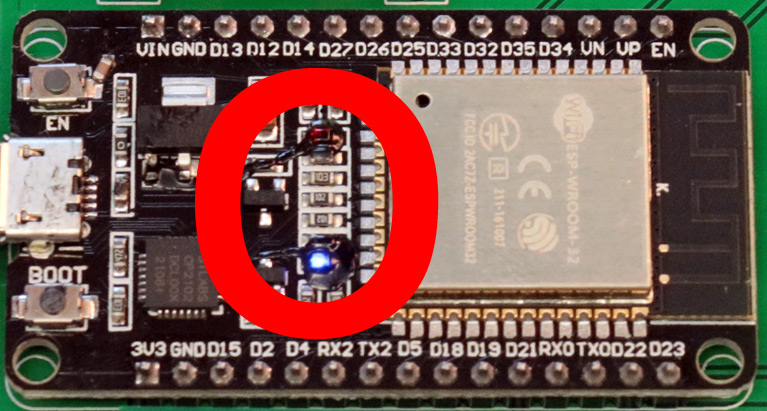

9. Before plugging the monitor in have a good look at all components and make sure that all components are installed in the correct location and orientation, all solder joints are well done and not short curcuited and everything looks right. Then plug a micro-usb cable into the ESP32 and flash the firmware.
   The monitor will start up and display the name of its WiFi access point in the first row on the display. After a short while it will also show a CO2 reading. Don't worry that the LEDs don't turn on quite yet as they'll need to be enabled in the configuration first.

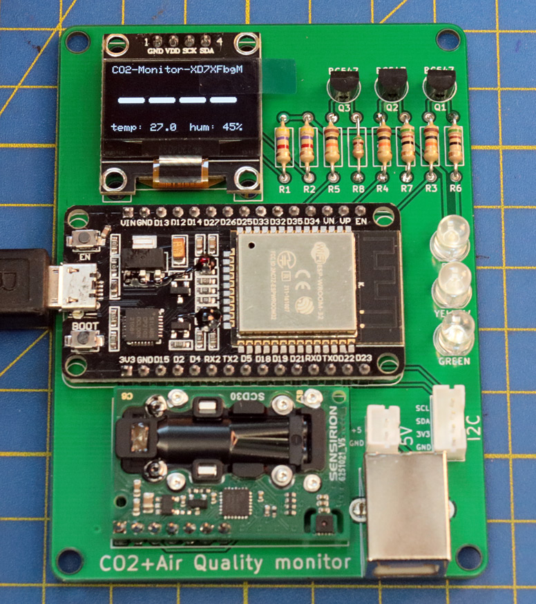


10. Connect to the monitor's Wifi access point and configure the Wifi and enable the LEDs by setting the following in the configuration

```
  "greenLed": 27,
  "yellowLed": 26,
  "redLed": 25,
```

You'll then see the LEDs light up accoring to the CO2 reading and the electrical part of the assembly is complete.

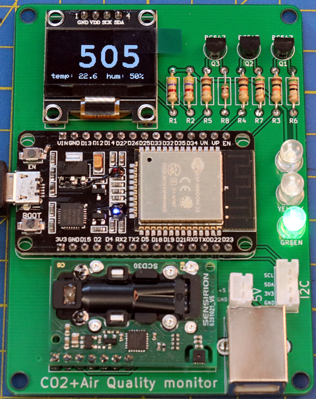

11. There are 2 ways to install the monitor in the case, placing it upside down on the front panel can be a little easier.
    Remove the protective film from the acrylic front panel and the LCD. Push the 4 screws through the front panel and place it on a flat surface with the screw heads facing down. Then push the stand offs over the screws before placing the PCB upside down over the screws:

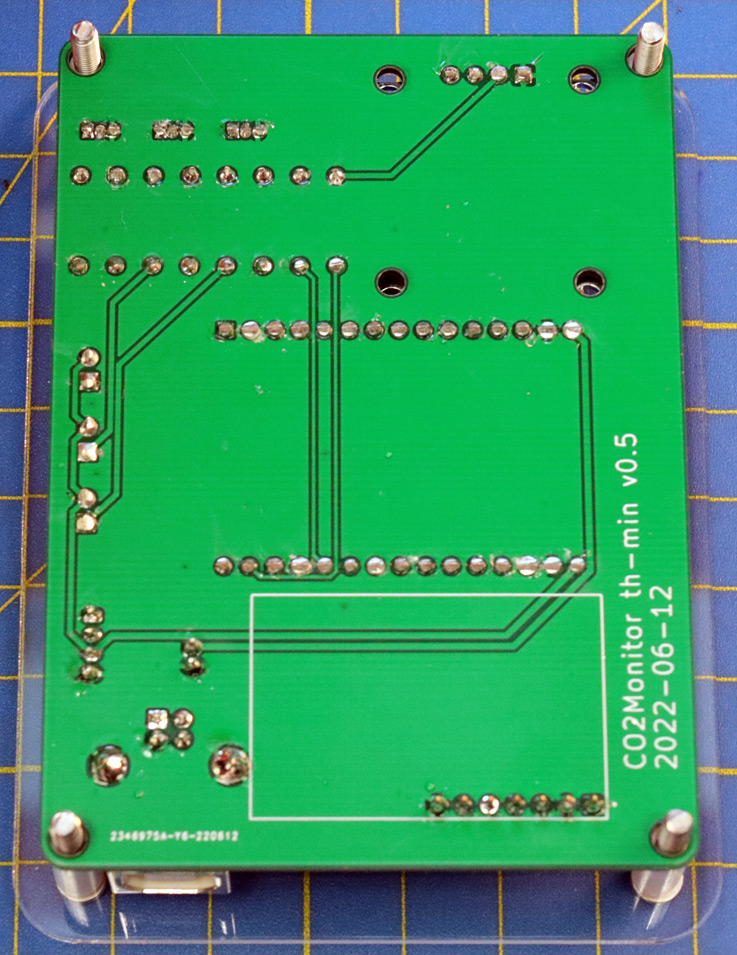

Then place the case upside down over the screws, carefully pushing the screws throgh the holes. Place the hex nuts, carefully lift the case sideways and secure the screws with an alan key without overtightening them. You can use a little bit of glue, electrical tape or similar to hold the hex nuts in place and stop them from falling out.

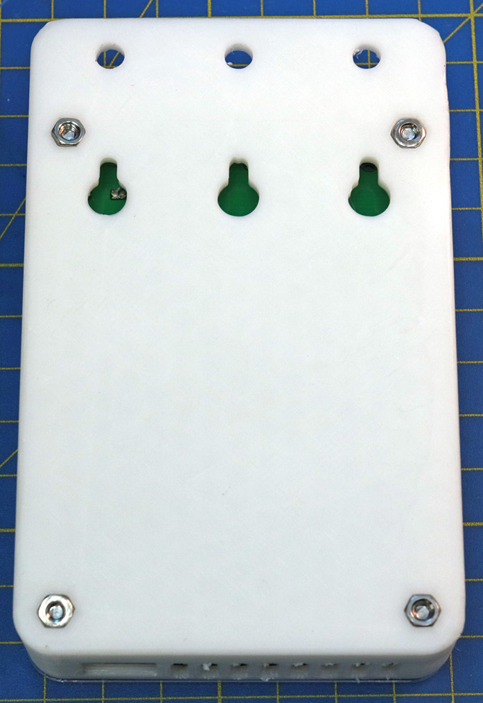

12. Alternatively start with the case in correct orientation and place the pcb into the case. You can insert the hex nuts first and secure them in place, or add them later depending on what works best for you. Remove the protective film from the display. Slide the stand offs over a screw driver or alan key into position and carefully let them rest on the pcb before placing the front panel onto the top. The stand offs don't need to be percfectly aligned and the front panel can be moved sideways to some degree while inserting the screws through the panel and standoffs into the bottom holes of the case. Secure the screws with an alan key without overtightening them.

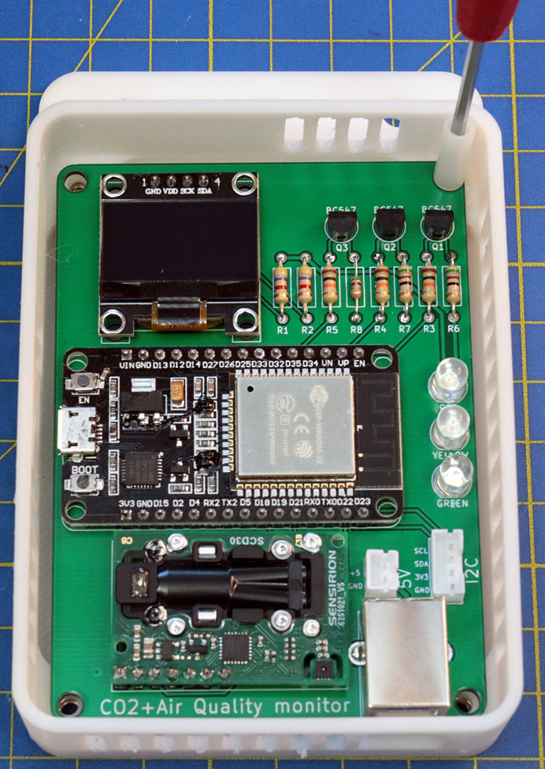


13. Finally stick the small diffusor film over the LEDs to make them a little less direct.


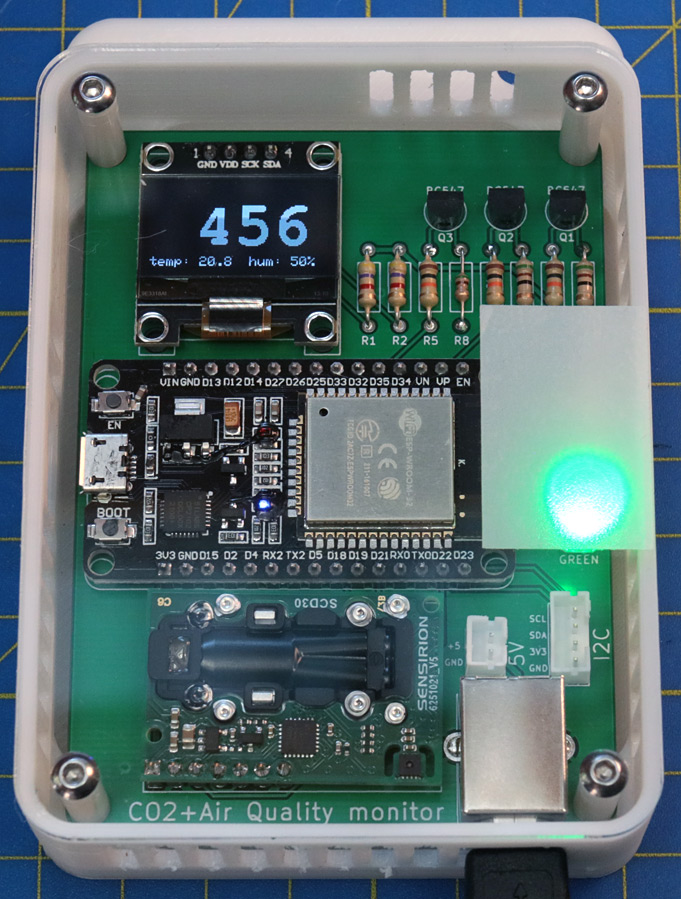
